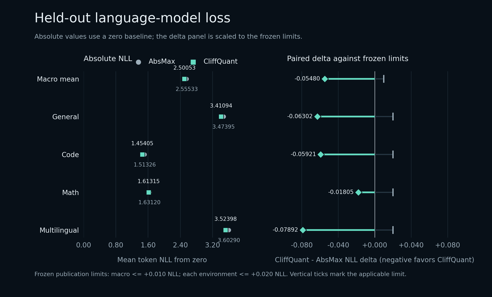
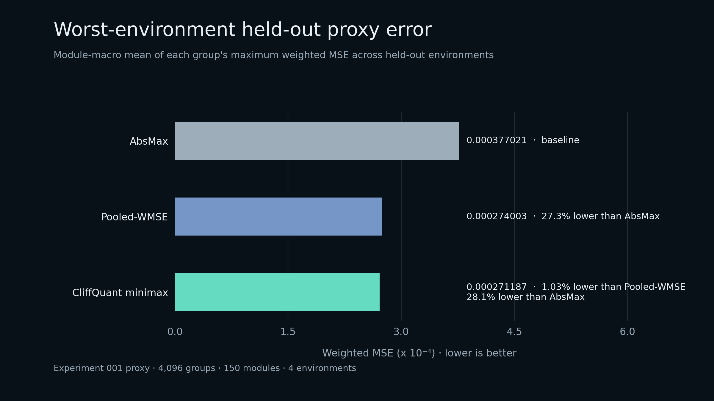
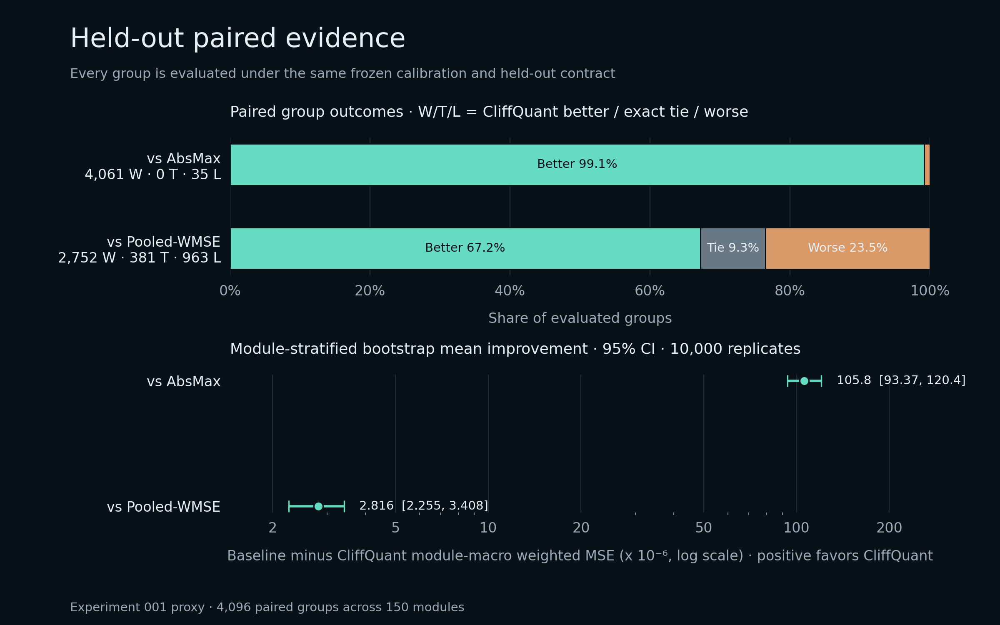

# CliffQuant

[](https://github.com/Labeeb2339/cliffquant/actions/workflows/ci.yml)
[](LICENSE)
[](https://huggingface.co/labeebaryan/Qwen3.5-0.8B-Base-CliffQuant-W4A16-G128)

Exact minimax FP16 scale selection for multi-environment W4A16 quantization.

I built CliffQuant around one narrow question: if a 128-weight group must use
one stored scale across several calibration environments, should that scale
minimize the worst environment directly instead of averaging the environments
first?

On the frozen Experiment 001 run with `Qwen3.5-0.8B-Base`, the answer was
positive for both the reconstruction proxy and held-out language-model loss.
The CliffQuant checkpoint lowered macro NLL from `2.555326` to `2.500527`
against a matched AbsMax checkpoint, with lower NLL in all four held-out
environments.



[Download the verified W4A16 checkpoint](https://huggingface.co/labeebaryan/Qwen3.5-0.8B-Base-CliffQuant-W4A16-G128)
|
[Inspect the curated evidence bundle](research/results/experiment-001)
|
[Read the frozen protocol](research/EXPERIMENT_001_PROTOCOL.md)

## Experiment 001

Both checkpoints use the same frozen base model, corpus, target modules, GPTQ
format, `4`-bit signed codes, symmetric quantization, group size `128`, and
`desc_act=false`. Only the stored group-scale policy changes.

### Held-out language-model loss

Each row contains 64 windows and 16,320 target tokens. Negative deltas favor
CliffQuant.

| Held-out environment | AbsMax NLL | CliffQuant NLL | CliffQuant - AbsMax |
|---|---:|---:|---:|
| Macro mean | `2.555326` | `2.500527` | `-0.054799` |
| General | `3.473953` | `3.410937` | `-0.063016` |
| Code | `1.513257` | `1.454046` | `-0.059211` |
| Math | `1.631195` | `1.613147` | `-0.018048` |
| Multilingual | `3.602898` | `3.523977` | `-0.078921` |

The preregistered limits allowed at most `+0.01` macro regression and `+0.02`
in any environment. The observed macro delta was `-0.054799`, and every
environment improved. The raw per-token evidence is checksummed; its NPZ SHA256
is `fdb24aaa192df5a91189eabebeb2831056e06a84f9ff127fae67b70e72e78934`.

### Held-out reconstruction proxy

The proxy gate used 4,096 real groups sampled across all 150 quantized
language-tower matrices.

| Scale policy | Module-macro worst-environment weighted MSE | Relative result |
|---|---:|---:|
| CliffQuant minimax | `0.0002711874` | reference |
| Pooled-WMSE | `0.0002740030` | CliffQuant `1.03%` lower |
| AbsMax | `0.0003770210` | CliffQuant `28.1%` lower |

Against Pooled-WMSE, the paired module-stratified bootstrap effect was
`2.816e-6`, with a frozen 95% interval of `[2.255e-6, 3.408e-6]`.
CliffQuant won on 2,752 groups, tied on 381, and lost on 963.





## What CliffQuant changes

For weights \(w_i\), separately normalized environment diagonals \(d_{e,i}\),
and one deployment-compatible stored scale \(s\), CliffQuant solves

$$
\min_s \max_e \sum_i d_{e,i}\left(w_i-sq_i(s)\right)^2
$$

where \(q_i(s)\) uses round-to-nearest, ties-to-even, followed by clipping to
`[-8, 7]`. The allowed set is every positive finite IEEE binary16 scale, with
the lower FP16 bit pattern breaking an exact objective tie.

The production solver enumerates the analytically sufficient candidates induced
by code transitions, quadratic vertices, and environment intersections. An
independent reference enumerates all 31,743 positive finite FP16 values.

CliffQuant does not require a custom inference kernel. The released model is a
standard GPTQ-v1 W4A16 checkpoint; the experiment changes scale selection, not
the packed runtime format.

## The negative result that changed the method

In an earlier, separate
[RecurQuant diagnostic](https://github.com/Labeeb2339/recurquant/blob/main/research/EXPERIMENT_001_SIGNAL_PIVOT.md)
on `Qwen3.5-0.8B-Base`, I tested four recurrent-state signals against exhaustive
single-layer INT4-to-INT8 interventions. Across retrieval and code traces, all
four were weak or inconsistent: the largest absolute Spearman correlation was
`0.408`, while forget activity and committed residual RMS changed sign.

I did not carry those handcrafted signals into CliffQuant. CliffQuant instead
estimates empirical activation-weighted sensitivity, preserves each
calibration environment separately, and optimizes the worst-environment scale
objective exactly. The RecurQuant diagnostic is context for this decision, not
part of CliffQuant's Experiment 001 evidence.

## Verification

- `10,000 / 10,000` deterministic solver cases matched exhaustive FP16
  enumeration, with zero mismatches.
- Both full scale runs completed all `3,883,008` W4/G128 groups.
- In 114 CliffQuant groups (`0.0029%`), a direct-candidate objective tie
  triggered conservative exhaustive-grid verification.
- Each packed checkpoint independently passed checks over 150 module-buffer
  sets and `497,025,024` unpacked signed codes.
- All 338 non-target tensors remained byte-exact and no dense target weight was
  left behind.
- Every one of the 150 quantized modules has different `qweight` and `scales`
  payloads between CliffQuant and AbsMax.
- A fresh empty-directory installation passed deterministic text and
  image-text generation twice (`16 / 16` generated tokens in both smokes).
- The publication builder reloads both live checkpoints, reruns held-out NLL,
  replays both frozen corpora, recomputes the proxy and bootstrap gates,
  regenerates all three figures, and publishes only after exact agreement.

The solver certificate SHA256 is
`a90b704c0d2e044c4a85c9dc45f604eedbfa5306c5f8719f149980b93d502cfd`.
The CliffQuant model payload SHA256 is
`b88ea7316a858c2691c1e755a5eb73ebfc08e19b45273a481a262f2099893beb`.
The checkpoint was built from commit
`d176c4944962d0bcd43a8092059fbf5098653bc6`; the final curated release
manifest SHA256 is
`b2c5b71820320a08028d5ea2069d136020f0c9c5801901695748e2ae9ed9d447`.

## Use the solver

```bash
python -m pip install -e .
```

```python
from cliffquant import QuantizerSpec, solve_breakpoint_exact

weights = [0.9, -0.4, 0.2, -1.1]
environment_diagonals = [
    [1.0, 0.8, 0.5, 1.2],
    [0.6, 1.4, 0.9, 0.7],
]

result = solve_breakpoint_exact(
    weights,
    environment_diagonals,
    QuantizerSpec(qmin=-8, qmax=7),
)

print(result.scale, result.objective, result.codes)
```

## Load the released checkpoint

Install the runtime used for verification:

```bash
python -m pip install "gptqmodel==7.3.4"
```

```python
import os

os.environ.setdefault("TORCH_COMPILE_DISABLE", "1")

from gptqmodel import BACKEND, GPTQModel

model = GPTQModel.load(
    "labeebaryan/Qwen3.5-0.8B-Base-CliffQuant-W4A16-G128",
    device="cuda:0",
    backend=BACKEND.GPTQ_TORCH,
    trust_remote_code=False,
)
```

The environment line keeps the portable `GPTQ_TORCH` path usable on Windows
without Triton; remove it if your TorchInductor/Triton setup is working.

This is a quantized **base** model, not an instruction-tuned chat model. The
language-tower target matrices are W4A16; the visual tower and other non-target
tensors remain at their original precision.

## Reproduce the checked surfaces

```bash
python -m pip install -e ".[dev,figures]"
python -m ruff check .
python -m ruff format --check .
python -m pytest
python -m build
```

Regenerate all three figures from the finalized proxy and NLL artifacts:

```bash
python scripts/generate_figures.py \
  --input-dir artifacts/experiment-001/proxy \
  --nll-input-dir artifacts/experiment-001/full-model/evidence/nll \
  --output-dir figures
```

The generator verifies the input checksum manifests before parsing results and
writes its own provenance to
[`figures/figure-manifest.json`](figures/figure-manifest.json).

Validate the exact checked-in inventory on any supported development platform:

```bash
python scripts/validate_publication_release.py \
  --inventory-only \
  research/results/experiment-001
```

This portable check rejects missing, extra, symlinked, reparse-point, size-drifted,
or hash-drifted release files. The deeper semantic replay omits
`--inventory-only`, but its solver-certificate check is intentionally bound to
the recorded Windows, Python 3.11.15, NumPy 2.2.6, and BLAS build. Recreate the
[frozen verification environment](research/PUBLICATION_VERIFICATION.md) before
running that stricter command.

## Research boundary

[PiSO](https://arxiv.org/abs/2606.10890) already establishes exact
breakpoint-based scale optimization as prior art. CliffQuant's candidate
distinction is the exact minimax objective over separately normalized
calibration environments, not exact scale optimization by itself.

Experiment 001 is one base model at one size, one quantization format, and one
frozen corpus construction. The positive proxy and NLL results do not prove
novelty, state of the art, downstream accuracy, latency gains, or broad
generalization.

Read the:

- [claim boundary](research/CLAIM_BOUNDARY.md);
- [prior-art review](research/PRIOR_ART.md);
- [solver certification result](research/SOLVER_CERTIFICATION_001_RESULT.md);
- [publication verification procedure](research/PUBLICATION_VERIFICATION.md);
  and
- [fail-closed release gate](research/PUBLICATION_RELEASE_GATE.md).

## Citation

Citation metadata is available in [`CITATION.cff`](CITATION.cff).

Apache-2.0.
