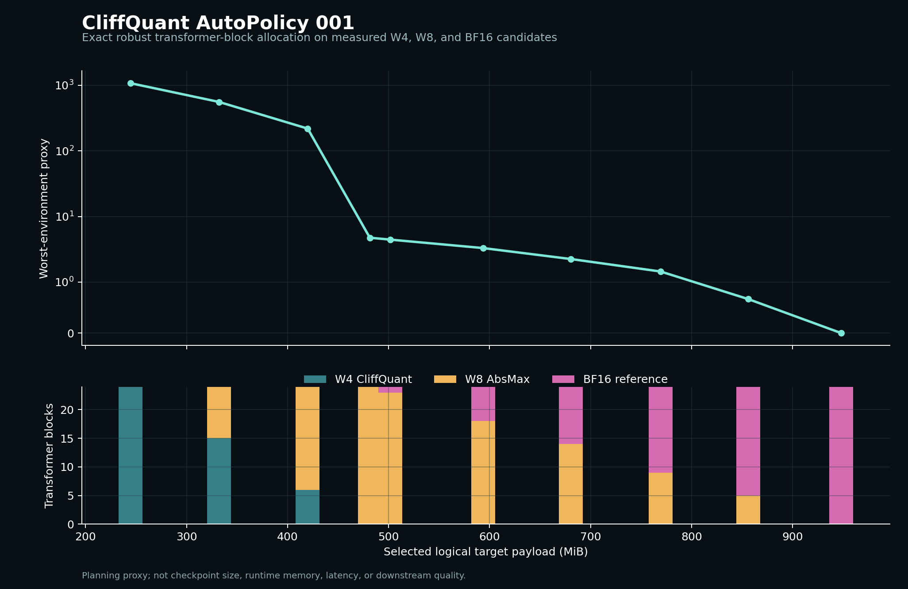

# AutoPolicy 001 result

## Outcome

The frozen candidate build completed all 150 target matrices across the four
Experiment 001 calibration environments. Its 150 W8 archives passed the
content-bound archive verifier. The robust publication view aggregates those
unchanged measurements into 24 transformer-block choices and solves the exact
recorded minimax proxy under each logical target-payload budget.

This is a planning result. No mixed-bit checkpoint or held-out mixed-policy NLL
is claimed.

## Measured frontier

| Selected logical bits per target weight | W4 blocks | W8 blocks | BF16 blocks | Worst-environment proxy |
|---:|---:|---:|---:|---:|
| `4.125` | 24 | 0 | 0 | `1078.217405` |
| `5.606` | 15 | 9 | 0 | `557.697827` |
| `7.087` | 6 | 18 | 0 | `218.811198` |
| `8.125` | 0 | 24 | 0 | `4.745117` |
| `10.019` | 0 | 18 | 6 | `3.296567` |
| `12.985` | 0 | 9 | 15 | `1.447354` |
| `16.000` | 0 | 0 | 24 | `0.000000` |

The checked-in frontier contains ten points. At the representative
`440,721,408`-byte budget, AutoPolicy selects 6 W4 blocks and 18 W8 blocks,
uses `440,303,616` bytes (`7.087025` logical bits per target weight), and
reduces the recorded worst-environment proxy by `79.706%` relative to the
all-W4 endpoint. This percentage is not a predicted NLL or accuracy change.



## Negative result and correction

The first exact 150-matrix robust search was not practically usable. Before
remaining-minimum feasibility pruning, even the all-W4 endpoint explored
incomplete high-byte prefixes and exceeded a two-minute run. After that bug was
fixed, the all-W4 endpoint completed with a one-state frontier and 150
transitions.

The nontrivial 150-matrix, four-environment frontier still grew too quickly for
the current multidimensional dynamic program. A capped all-W8-budget attempt
did not complete within 60 seconds. AutoPolicy therefore does not hide an
approximation or advertise that path as production-ready.

The published robust view instead makes the deployment constraint explicit:
one candidate is selected per transformer block. Aggregating the same matrix
measurements produced 24 units. On the development machine, the all-W8 budget
then solved in about `0.12` seconds with a peak frontier of 122 states and
3,712 evaluated transitions. The result is exact for that block-constrained
problem.

## Logical payload endpoints

| Uniform policy | Logical bytes | Logical bits per target weight |
|---|---:|---:|
| W4 CliffQuant | `256,278,528` | `4.125` |
| W8 AbsMax | `504,791,040` | `8.125` |
| Unquantized BF16 source reference | `994,050,048` | `16.000` |

These values cover target weight codes and stored group scales only. They are
not checkpoint sizes or runtime-memory measurements.

## Portable evidence

The directory
[`research/results/autopolicy-001`](results/autopolicy-001) contains:

- the canonical 150-matrix candidate table;
- all 150 content-addressed W8 measurement archives;
- the content-bound 24-block candidate view;
- the ten-point robust frontier;
- the representative `7.087`-bit plan; and
- a deterministic 154-file release manifest.

Key identities:

- matrix candidate SHA256:
  `308db237ade8bae8346a9c86c937ebde0d1c430d59e479ff90797c3892f9c9d7`;
- block candidate SHA256:
  `248268b088e8f82aa2125fa254f0ada7d2d120943199322bcef4f95beb633b3b`;
- representative plan SHA256:
  `1e0fe3afec4864f565cec59dd8010f038536705b482b401259d99dd73472c490`;
  and
- release manifest SHA256:
  `b4308c2392a6895e6992cba92d68db0bb5a0b3786f11d66cec897af06d9cdce3`.

Revalidate the portable evidence from a repository checkout:

```bash
python scripts/validate_autopolicy_release.py \
  research/results/autopolicy-001
```

## Claim boundary

AutoPolicy 001 supports one narrow result: at the selected allocation
granularity, it returns the exact optimum of the recorded additive proxy table
under the recorded logical-byte budget when the configured exact search
completes.

It does not establish novelty, downstream quality, a globally optimal
quantized model, checkpoint size, runtime memory, latency, energy, or hardware
throughput.
